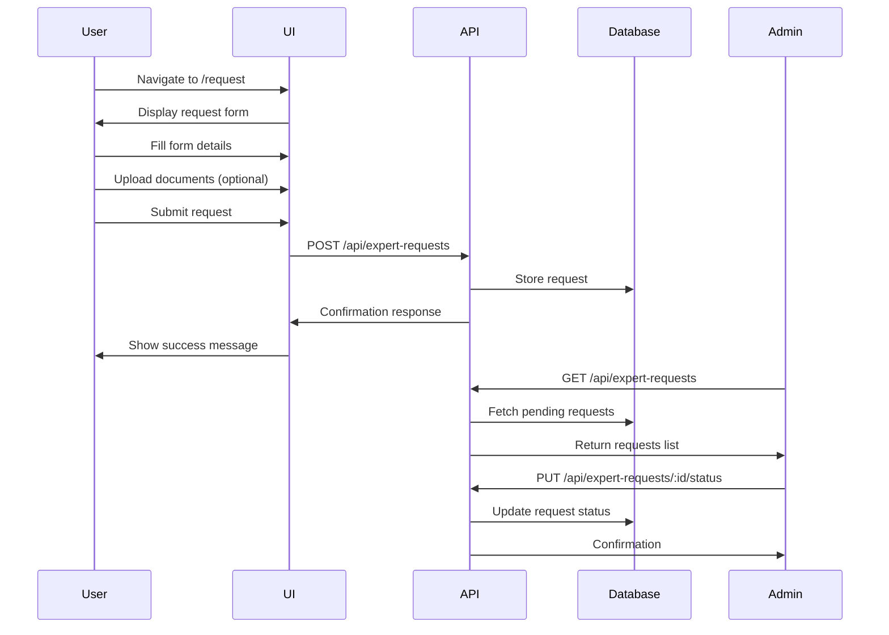
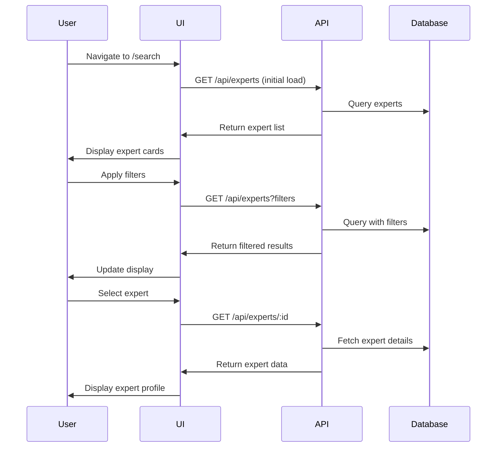

# ExpertDB UI/UX Design Guidelines

This document outlines the UI/UX design guidelines for the ExpertDB system based on the Bahrain Education & Training Quality Authority (BQA) brand guidelines. It provides a comprehensive guide for implementing consistent design across the application.

## Brand Identity

### Logo Usage

The BQA logos should be used according to these guidelines:

1. **Horizontal Logo** (`BQA - Horizontal Logo.svg`):
   - Use in the main navigation header
   - Minimum width: 150px on desktop
   - Clear space: At least 20px around all sides

2. **Horizontal Logo with Descriptor** (`BQA - Horizontal Logo with Descriptor.svg`):
   - Use on the login page (first point of contact for users)
   - Minimum width: 180px on desktop
   - Clear space: At least 25px around all sides

3. **Vertical Logo** (`BQA - Vertical Logo - With descriptor.svg`):
   - Use in the footer or sidebar
   - Minimum height: 150px
   - Clear space: At least 20px around all sides

4. **Icon Logo** (`Icon Logo - Color.svg`):
   - Use for favicon and smaller UI elements
   - Minimum size: 32px × 32px
   - Clear space: At least 8px around all sides

### Color Palette

The color palette for the ExpertDB system is based on the BQA brand colors:

| Color | Hex Code | Usage |
|-------|----------|-------|
| Primary Navy Blue | #133566 | Main navigation, primary buttons, headings |
| Secondary Light Blue | #1B4882 | Secondary elements, hover states, accents |
| Green | #192012 | Success messages, positive indicators, subtle accents |
| Orange | #DC8335 | Warnings, notifications, call-to-action elements |
| Red | #FF4040 | Errors, alerts, destructive actions |
| White | #FFFFFF | Background, text on dark colors |
| Light Gray | #F5F5F5 | Backgrounds, separators |
| Medium Gray | #D1D5DB | Borders, disabled states |
| Dark Gray | #4B5563 | Secondary text, icons |
| Black | #111827 | Primary text |

### Typography

The typography system follows these guidelines:

**Font Family**:
- Primary: Graphik for English text
- Use appropriate system fallbacks:
  ```css
  font-family: "Graphik", -apple-system, BlinkMacSystemFont, "Segoe UI", Roboto, "Helvetica Neue", Arial, sans-serif;
  ```

**Font Sizes**:
- Headings:
  - H1: 2.5rem (40px)
  - H2: 2rem (32px)
  - H3: 1.5rem (24px)
  - H4: 1.25rem (20px)
  - H5: 1.125rem (18px)
  - H6: 1rem (16px)
- Body text: 1rem (16px)
- Small text: 0.875rem (14px)
- Caption text: 0.75rem (12px)

**Font Weights**:
- Regular: 400
- Medium: 500
- Semibold: 600
- Bold: 700

**Line Heights**:
- Headings: 1.2
- Body text: 1.5
- Tight: 1.25

## Components

### Buttons

Buttons should follow these design guidelines:

**Primary Button**:
- Background: Navy Blue (#133566)
- Text: White (#FFFFFF)
- Border: None
- Hover: Light Blue (#1B4882)
- Disabled: Navy Blue with opacity 0.5
- Padding: 0.5rem 1rem (8px 16px)
- Border radius: 4px

**Secondary Button**:
- Background: White (#FFFFFF)
- Text: Navy Blue (#133566)
- Border: 1px solid Navy Blue (#133566)
- Hover: Light Gray background (#F5F5F5)
- Disabled: Opacity 0.5
- Padding: 0.5rem 1rem (8px 16px)
- Border radius: 4px

**Danger Button**:
- Background: Red (#FF4040)
- Text: White (#FFFFFF)
- Border: None
- Hover: Darker red (#E03131)
- Disabled: Opacity 0.5
- Padding: 0.5rem 1rem (8px 16px)
- Border radius: 4px

### Form Elements

**Input Fields**:
- Border: 1px solid Medium Gray (#D1D5DB)
- Border radius: 4px
- Focus: 2px border Light Blue (#1B4882)
- Padding: 0.5rem (8px)
- Error state: 1px border Red (#FF4040)
- Placeholder: Medium Gray (#9CA3AF)

**Dropdown**:
- Same styling as input fields
- Dropdown icon: Dark Gray (#4B5563)

**Checkboxes and Radio Buttons**:
- Unchecked: 1px border Medium Gray (#D1D5DB)
- Checked: Navy Blue (#133566) fill
- Size: 16px × 16px

**Form Labels**:
- Color: Dark Gray (#4B5563)
- Font size: 0.875rem (14px)
- Font weight: Medium (500)
- Margin bottom: 0.25rem (4px)

### Cards

**Standard Card**:
- Background: White (#FFFFFF)
- Border: 1px solid Light Gray (#E5E7EB)
- Border radius: 8px
- Shadow: 0 2px 4px rgba(0, 0, 0, 0.05)
- Padding: 1.5rem (24px)

**Elevated Card**:
- Same as standard card
- Shadow: 0 4px 6px rgba(0, 0, 0, 0.1)

**Interactive Card**:
- Same as standard card
- Hover: Shadow: 0 4px 6px rgba(0, 0, 0, 0.1)
- Transition: All 0.2s ease

### Tables

**Table Styling**:
- Header background: Light Gray (#F5F5F5)
- Header text: Dark Gray (#4B5563)
- Header font weight: Semibold (600)
- Row border: 1px solid Light Gray (#E5E7EB)
- Alternate row background: Very Light Gray (#F9FAFB)
- Cell padding: 0.75rem 1rem (12px 16px)

### Navigation

**Main Navigation**:
- Background: Navy Blue (#133566)
- Text: White (#FFFFFF)
- Active item: Border-bottom: 2px solid Orange (#DC8335)
- Hover: Light Blue (#1B4882)
- Height: 64px
- Padding: 0 1.5rem (0 24px)

**Sidebar Navigation**:
- Background: White (#FFFFFF)
- Text: Dark Gray (#4B5563)
- Active item: Left border: 4px solid Navy Blue (#133566), Background: Light Gray (#F5F5F5)
- Hover: Light Gray (#F5F5F5)
- Item padding: 0.75rem 1rem (12px 16px)

## Layout

### Grid System

Use a 12-column grid system with these specifications:
- Container width: Maximum 1280px
- Gutter: 2rem (32px)
- Column width: Fluid
- Breakpoints:
  - Mobile: < 640px
  - Tablet: 640px - 1024px
  - Desktop: > 1024px

### Spacing System

Use a consistent spacing scale:
- 0.25rem (4px): Minimal spacing
- 0.5rem (8px): Tight spacing
- 0.75rem (12px): Compact spacing
- 1rem (16px): Standard spacing
- 1.5rem (24px): Comfortable spacing
- 2rem (32px): Loose spacing
- 3rem (48px): Very loose spacing
- 4rem (64px): Section spacing

### Page Layout

**Standard Page**:
- Header: 64px height
- Content padding: 2rem (32px)
- Max content width: 1280px
- Footer: 160px height

**Admin Dashboard**:
- Sidebar: 250px width
- Content padding: 2rem (32px)
- Header: 64px height

## Specific Page Implementations

### Login Page

Based on the sample implementation:
- Center-aligned card on a white background
- BQA horizontal logo with descriptor in the header
- Navy blue header bar
- White card with subtle shadow
- Form with email and password fields
- Primary button for sign-in
- Subtle animations for feedback
- Footer with copyright information

### Dashboard

- Top navigation bar with BQA horizontal logo
- Welcome message with user name
- Statistics cards in grid layout
- Recent activity section
- Quick actions section
- Tabs for different data views
- Data visualization components with BQA color scheme

### Expert Search

- Search input at top
- Filter sidebar with collapsible sections
- Results displayed in cards or table format
- Pagination controls
- Sort options
- Detail view accessible via click

### Expert Request Form

- Multi-step form with progress indicator
- Clear section headers
- Validation feedback
- Preview step before submission
- Success confirmation page after submission
- Save as draft functionality

## Interaction Design

### Feedback and States

**Success States**:
- Green (#192012) for success icons/messages
- Checkmark icon
- Brief fade-in animation

**Error States**:
- Red (#FF4040) for error messages
- Error icon
- Brief bounce animation for emphasis

**Loading States**:
- Subtle pulse animation
- Skeleton loaders for content
- Progress indicators for uploads/downloads

### Animations

Use subtle animations for:
- Hover states
- Transitions between pages
- Form submission feedback
- Loading indicators
- Error/success messages

Animation guidelines:
- Duration: 200ms - 300ms for most transitions
- Timing function: ease or ease-in-out
- Respect user preferences for reduced motion

## Accessibility Guidelines

- Maintain a minimum contrast ratio of 4.5:1 for text
- Provide alternative text for all images
- Design with keyboard navigation in mind
- Support screen readers with appropriate ARIA attributes
- Implement focus indicators for keyboard users
- Allow zoom without breaking layouts
- Support text scaling up to 200%

## Implementation Examples
**note:the file /frontend/guidelines/information.md mentioned below doesn't exits. Message to CLAUDE: Confirm, do the needful when seeing this message and edit what is neccessary**
The sample login page implementation provided in `/frontend/guidelines/information.md` demonstrates these design principles in action, showcasing:

1. Correct use of BQA colors
2. Proper logo placement
3. Appropriate typography
4. Subtle animations for feedback
5. Form design with validation
6. Responsive layout
7. Accessibility considerations

## Moving the Logos

**note:the similarly the dir /frontend/guidelines/logo/ mentioned below doesn't exits. Message to CLAUDE: Confirm, do the needful when seeing this message and edit what is neccessary**
When implementing pages, move the logo files from `/frontend/guidelines/logo/` to the appropriate location in the `/public` directory to make them accessible in the application.

---

This document should be used as a reference when implementing UI components and pages to ensure a consistent, professional, and accessible user experience that aligns with the BQA brand guidelines.

## Site Structure

The ExpertDB application follows this page hierarchy and navigation flow:

```mermaid
graph TD
    Root[/] --> |Auth Check| Search[/search]
    Root --> |No Auth| Login[/login]
    Login --> |Success| Search
    Search --> |View Expert| Expert[/expert/:id]
    Search --> |New Request| Request[/request]
    Navbar --> Search
    Navbar --> Request
    Navbar --> |Authenticated| Panel[/panel]
    Navbar --> |Authenticated| Statistics[/statistics]
    Navbar --> |Admin Only| Admin[/admin]
    Admin --> Users[/admin/users]
    Admin --> Requests[/admin/requests]
    Admin --> Settings[/admin/settings]
```

### Page Purposes
- **Root (/)**: Redirects to /search if authenticated or /login if not (login page is the first point of contact)
- **/login**: Authentication page with email/password form
- **/search**: Main application page for searching experts with filters
- **/expert/:id**: Detailed view of a specific expert
- **/request**: Form to submit a new expert request
- **/panel**: AI-assisted expert panel suggestion
- **/statistics**: Visual data statistics about the expert database
- **/admin/***: Admin-only pages for user and request management

## Process Flows

### Expert Request Submission Process



### Expert Search Flow



## Logo Usage Guidelines

The ExpertDB application uses specific logo variants based on context:

1. **Navbar**: Use `BQA - Horizontal Logo.svg` 
   - Cleaner appearance suitable for the colored background
   - Width: 150px, Height: auto (preserving aspect ratio)
   - Provides brand identity without descriptor for space efficiency
   
2. **Login Page**: Use `BQA - Horizontal Logo with Descriptor.svg`
   - Full branding with descriptor for the formal login experience
   - Width: 180px, Height: auto (preserving aspect ratio)
   - Centers user focus on the complete brand identity
   
3. **Footer**: Use `Icon Logo - Color.svg`
   - Compact appearance suitable for footer
   - Width: 32px, Height: 32px
   - Paired with text copyright information

4. **Favicon**: Use `Icon Logo - Color.svg`
   - Standard favicon usage
   - 32px × 32px size
